<div align="center">

# OneClickSuite
### AI 电商产品图一键生成平台
**上传一张产品图，AI 自动生成完整产品图库 · 无需设计技能 · 节省 90% 成本**

[](https://github.com/YuanCheng888/OneClickSuite)
[](https://github.com/YuanCheng888/OneClickSuite)
[](https://github.com/YuanCheng888/OneClickSuite/issues)
[](https://github.com/YuanCheng888/OneClickSuite/blob/master/LICENSE)
[](https://github.com/YuanCheng888/OneClickSuite/commits)
[](https://github.com/YuanCheng888/OneClickSuite/graphs/contributors)
[](https://nodejs.org/)

🌐 **中文** | [English](README_EN.md)

</div>

---

## 🎯 项目简介

**OneClickSuite** 是一款专为电商卖家打造的 **AI 产品图片生成平台**。上传一张产品图，AI 自动生成完整的产品图库，支持亚马逊、TEMU、Shopify、TikTok Shop 等主流电商平台。

> 🚀 **无需设计技能，零门槛上手。告别影棚，节省 90% 成本。**

## 🔗 在线演示

**体验地址**: [https://oneclicksuite-demo.vercel.app](https://oneclicksuite-demo.vercel.app)

> ⚠️ **注意**: Demo 环境的 Gemini API Key 已过期，AI 生成功能暂时不可用，仅供界面预览。

---

## 📷 产品预览

### 原图 → AI 生成

| 原图上传                                         | AI 生成效果                                        |
| :------------------------------------------- | :--------------------------------------------- |
|  |  |

### 多场景展示

| 场景一                                           | 场景二                                           | 场景三                                           | 场景四                                           |
| :-------------------------------------------- | :-------------------------------------------- | :-------------------------------------------- | :-------------------------------------------- |
|  |  |  |  |

---

## 🖥️ 界面预览

### 主要功能页面

| 功能模块               | 截图预览                                                                         |
| :----------------- | :--------------------------------------------------------------------------- |
| 落地页(Landing)      |             |
| 产品上传页(Upload)     | 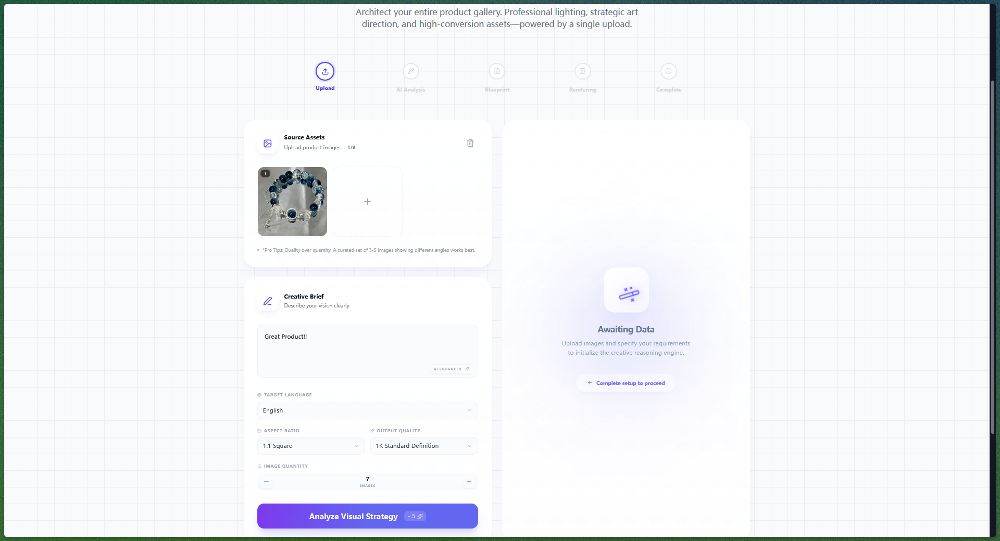                   |
| AI策划页(Blueprint) | 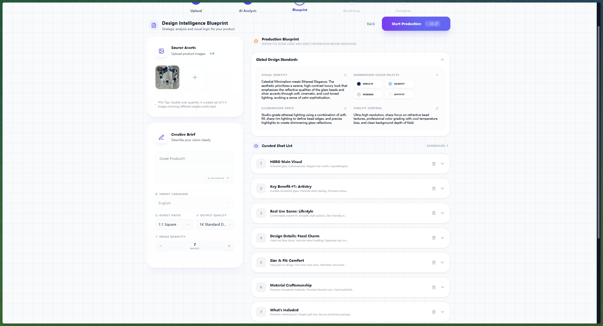               |
| 策划详情页(Detail)     | 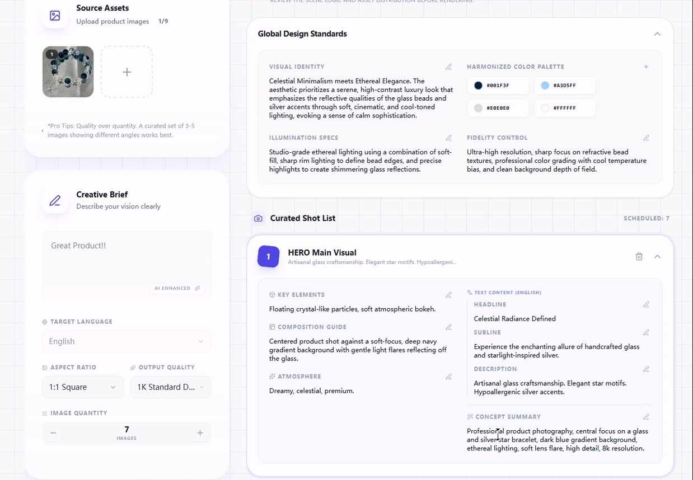 |

### 策划列表与详情

| 功能模块               | 截图预览                                                                            |
| :----------------- | :------------------------------------------------------------------------------ |
| 策划列表页(Shot List)  | 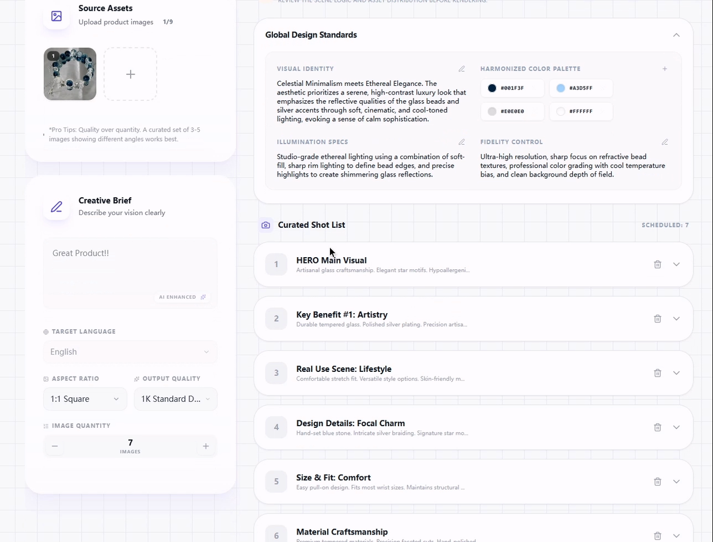        |
| 策划详情页2(Detail 2) | 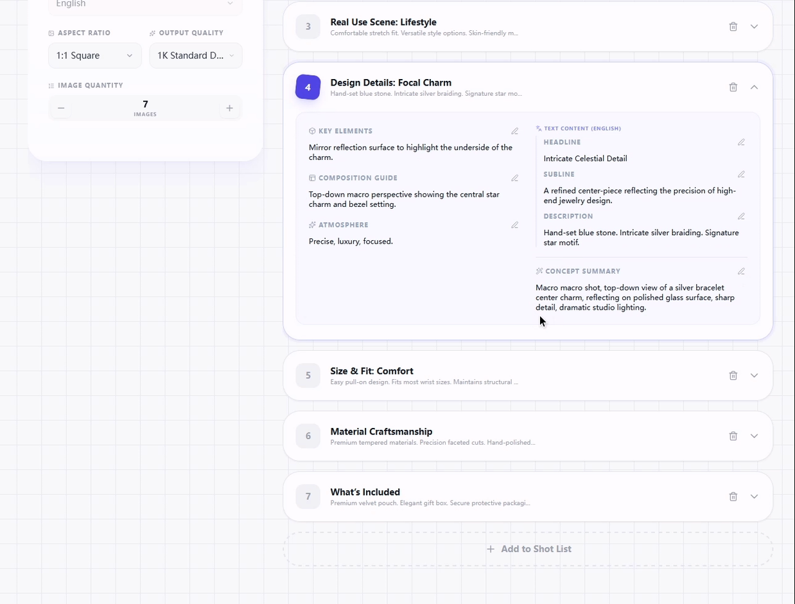 |

### 支付与定价

| 功能模块           | 截图预览                                                     |
| :------------- | :------------------------------------------------------- |
| 定价页(Pricing)     | 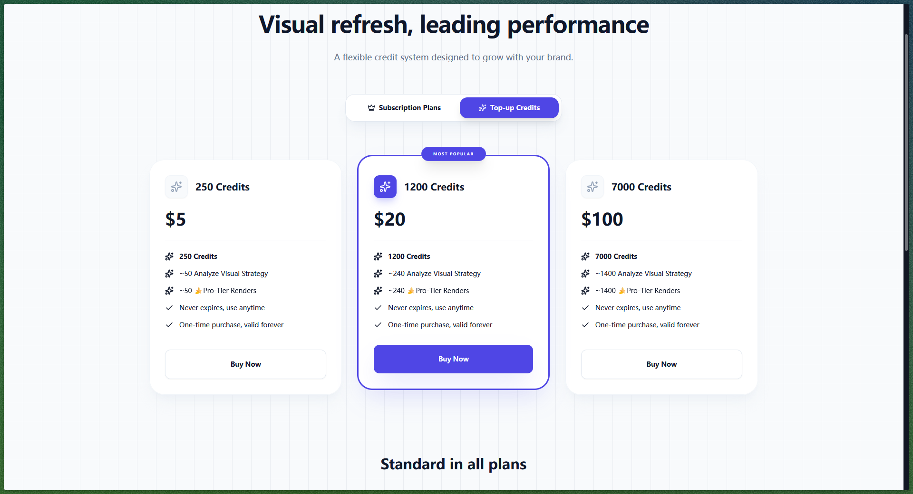 |

### 主题对比(Dark & Light)

| 主题                 | 截图预览                                                             |
| :----------------- | :--------------------------------------------------------------- |
| 深色主题登录页(Dark Theme)  | 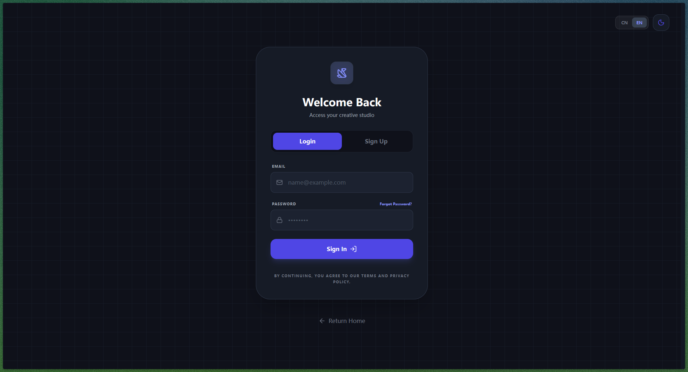   |
| 浅色主题登录页(Light Theme) | 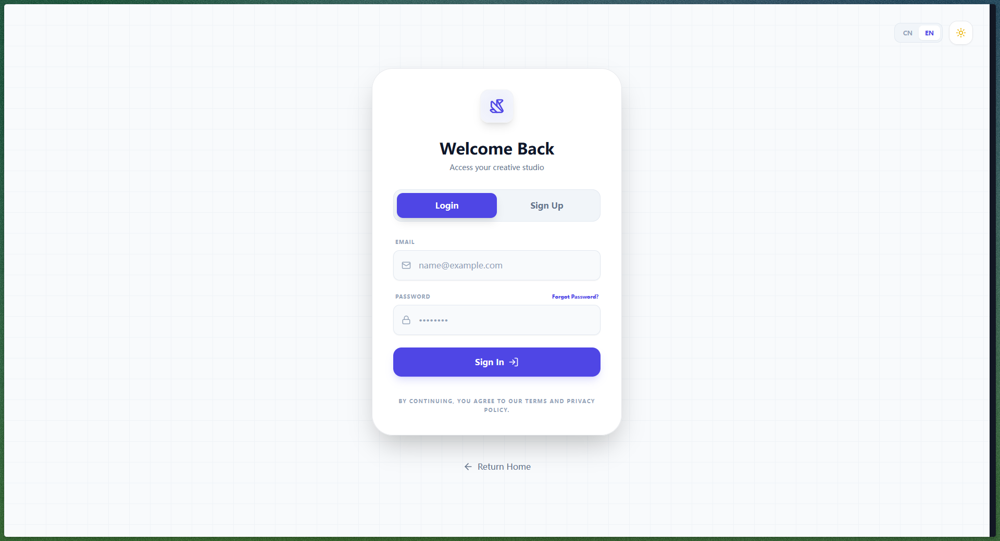 |

### 画廊与编辑功能

| 功能模块                | 截图预览                                                            |
| :------------------ | :-------------------------------------------------------------- |
| 历史图库(Creative Gallery) |       |
| 结果详情页(Result Detail) |  |
| 编辑优化+版本管理(Refine & Version) |  |

### 法律文档

| 关于页(About)                                     | 服务条款(Terms)                                   | 隐私政策(Privacy)                                     |
| :-------------------------------------------- | :-------------------------------------------- | :---------------------------------------------- |
| 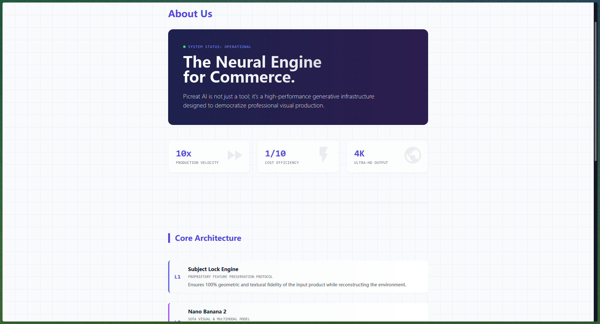 | 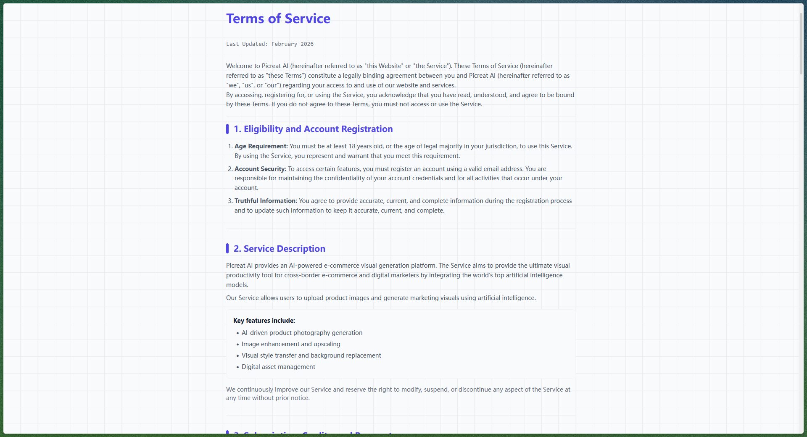 | 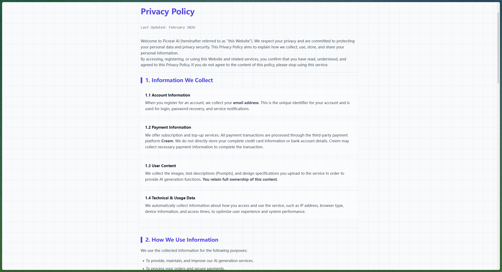 |

---

## ✨ 核心功能

| 功能模块              | 说明                                       |
| :---------------- | :--------------------------------------- |
| 🎨 一键出套图         | 上传单张产品图，自动生成完整产品图库                |
| 🤖 AI 智能分析        | 自动提取产品 USP，生成符合平台算法的视觉策略          |
| 🎬 多场景融合         | 产品与真实场景的像素级无缝融合                    |
| 📦 批量生成          | 一键产出多角度、多场景的详情页素材                 |
| 🌐 全平台适配         | 深度适配各大电商平台推荐算法                    |
| 🔒 主体识别固定        | 支持多图输入，AI 智能识别并固定产品主体             |
| 👁️ Blueprint 预览    | 生成前预览完整视觉方案，支持编辑微调               |
| ✏️ Refine 单图优化    | 局部重绘、版本管理、快速迭代                     |

### 📋 生成配置

| 配置项        | 选项                                       |
| :-------- | :--------------------------------------- |
| 🌍 生图语言   | 22种语言覆盖全球主流电商平台                    |
| 📐 尺寸比例   | 10种比例 (1:1, 16:9, 9:16 等)               |
| 🖼️ 出图分辨率 | 1K / HD(2K) / UHD(4K)                    |
| 📊 出图数量   | 1-20张，默认1张                             |

### 🎯 Blueprint 预览系统

#### 设计规范库
```
视觉风格(Visual Style)    → 整体视觉方向
色彩系统(Color Palette)    → 品牌配色方案（可编辑）
字体系统(Typography)       → 排版风格定义
光线(Lighting)            → 布光方案
构图(Composition)          → 画面构图规则
目标受众(Target Audience)  → 用户群体描述
质量标准(Quality)          → 专业商业级修图标准
产品主体(Subject Lock)     → 物理特征描述
```

#### 单图策划
```
标题(Title)        → 镜头编号和命名
描述(Description)  → 镜头用途和场景说明
构图(Composition)   → 画面构图方式
道具(Props)         → 场景道具和元素
特征(Features)      → 核心卖点展示
氛围(Mood)         → 情感基调
Prompt            → 完整AI生成提示词（可编辑）
```

#### 文本内容
```
标题(Headline)    → 主标题文案
副标题(Subline)   → 辅助说明文案
描述(Description) → 详细描述文案
```

#### 智能切分
```
AI 自动切分 → 镜头序列(Shot Sequences)
批量生成   → 一键产出所有策划镜头
增删镜头   → 自由添加或删除镜头
```

### 🔧 Refine 单图优化

| 功能              | 说明                        |
| :-------------- | :------------------------ |
| ✏️ 局部重绘        | 对单张图片进行局部细节优化            |
| 📜 版本管理        | 保留完整的历史版本记录              |
| 🔄 快速迭代        | 基于历史版本快速生成多个变体           |
| ⚖️ 对比查看        | 支持新旧版本对比                   |

### 🔐 用户系统
- 邮箱验证码登录（安全无密码）
- 密码重置和个人信息管理
- 多语言支持（中文/英文）

### 📤 素材管理
- 支持多种图片格式上传
- 自定义营销文案和风格偏好
- Creative Gallery 历史图库管理

### 💰 支付系统
- **Creem** - 主支付系统，集成订阅和积分充值
- **Stripe** - 备选支付方案，支持信用卡支付
- 灵活的积分套餐和订阅计划

---

## 🚀 快速开始

### 环境要求

| 依赖         | 版本      |
| :--------- | :------ |
| Node.js    | >= 18.x |
| npm        | >= 9.x  |
| Vercel CLI | 最新版本    |

### 安装步骤

```bash
# 1. 克隆仓库
git clone https://github.com/YuanCheng888/OneClickSuite.git
cd OneClickSuite

# 2. 安装依赖
npm install

# 3. 配置环境变量
cp .env.example .env

# 4. 启动开发服务器
vercel dev

# 5. 访问应用
# 打开 http://localhost:3000
```

<details>
<summary><strong>环境变量配置</strong></summary>

编辑 `.env` 文件，配置以下关键参数：

```env
# 应用配置
VITE_APP_NAME=OneClickSuite

# Supabase 数据库配置（必填）
VITE_SUPABASE_URL=your_supabase_url
VITE_SUPABASE_ANON_KEY=your_supabase_anon_key
SUPABASE_SERVICE_ROLE_KEY=your_supabase_service_role_key

# AI 服务配置（必填）
GEMINI_API_KEY=your_gemini_api_key
GEMINI_BASE_URL=https://generativelanguage.googleapis.com/v1beta

# 支付系统配置（选择一个即可）
# 方案一：使用 Creem（推荐）
CREEM_API_KEY=your_creem_api_key
CREEM_WEBHOOK_SECRET=your_creem_webhook_secret
VITE_CREEM_PUBLISHABLE_KEY=your_creem_publishable_key

# 方案二：使用 Stripe
STRIPE_SECRET_KEY=your_stripe_secret_key
STRIPE_WEBHOOK_SECRET=your_stripe_webhook_secret
VITE_STRIPE_PUBLISHABLE_KEY=your_stripe_publishable_key
```

</details>

<details>
<summary><strong>Stripe 配置说明</strong></summary>

如需使用 Stripe 支付系统，请确保完成以下配置：

1. **创建 Stripe 账户**: 访问 [Stripe Dashboard](https://dashboard.stripe.com/) 注册账户
2. **获取 API 密钥**:
   - `STRIPE_SECRET_KEY`: 从 Stripe Dashboard 获取
   - `STRIPE_WEBHOOK_SECRET`: 通过 `stripe listen --forward-to localhost:3000/api/webhook/stripe` 生成
   - `VITE_STRIPE_PUBLISHABLE_KEY`: 从 Stripe Dashboard 获取
3. **配置 Webhook**: 在 Stripe Dashboard 中配置以下事件：
   - `checkout.session.completed`
   - `customer.subscription.created`
   - `customer.subscription.updated`
   - `customer.subscription.deleted`

</details>

### 部署到生产环境

```bash
# 构建生产版本
npm run build

# 部署到 Vercel
vercel deploy --prod
```

---

## 📖 使用流程

```
Upload(上传产品图) → AI Analysis(AI智能分析) → Blueprint(生成创意方案) → Rendering(AI生成图片) → Complete(完成)
```

1. **登录/注册** - 使用邮箱验证码登录系统
2. **Upload(上传产品图片)** - 上传您的产品照片作为生成基础，定义营销文案、风格和输出比例
3. **AI Analysis(AI智能分析)** - 系统自动分析产品并提取关键特征
4. **Blueprint(生成创意方案)** - AI生成完整的创意策划方案，包括场景、角度、配色等
5. **Rendering(AI生成图片)** - 确认方案后，AI批量生成高质量产品图片
6. **Complete(完成)** - 在Creative Gallery中查看、编辑和下载生成的图片

---

## 🛠️ 技术栈

| 分类    | 技术                          | 版本   |
| :---- | :-------------------------- | :--- |
| 前端框架  | React                       | 19.x |
| 语言    | TypeScript                  | 5.x  |
| 构建工具  | Vite                        | 7.x  |
| 后端    | Vercel Serverless Functions | -    |
| 数据库   | Supabase (PostgreSQL)       | -    |
| AI 服务 | Gemini AI                   | -    |
| 支付系统  | Creem / Stripe              | -    |
| UI 框架 | Tailwind CSS                | 3.x  |
| 动画    | Framer Motion               | 12.x |
| 图标    | Lucide React                | -    |

---

## 🗄️ Supabase 数据库设计

### 📊 核心业务表

| 表名 | 说明 | 关键字段 |
| :--- | :--- | :--- |
| `profiles` | 用户中心：积分余额、订阅等级、支付平台关联、界面语言 | credits, tier, stripe_customer_id, creem_customer_id, app_language |
| `generations` | AI任务记录：分析/生成/编辑三种类型，完整生命周期追踪 | type, status, prompt(jsonb), full_prompt(jsonb), result(jsonb) |
| `assets` | 文件资产：产品图、蒙版、生成图片的存储路径和元数据 | storage_path, public_url, asset_type, generation_id |
| `credit_rules` | **动态积分规则**：管理员可配置每个操作的积分成本 | action_type, cost, description |
| `credit_logs` | **完整审计日志**：每次积分变动都有记录，支持溯源 | user_id, action_type, change_amount, balance_after, metadata(jsonb) |
| `credit_packages` | 积分套餐定义：名称、积分数量、价格、订阅等级、支付产品ID | credits, price, tier, creem_product_id |
| `orders` | **支付订单记录**：支付平台、订单号、金额、状态全链路 | provider, provider_order_id, amount, status, metadata(jsonb) |
| `transaction_logs` | **事务调试日志**：原子操作的中间状态记录，用于排查问题 | user_id, action, status, details(jsonb) |
| `mode_models` | **AI模型配置**：不同模式使用的模型及优先级 | mode, model_name, priority |

### 🤖 AI 模型配置表 `mode_models`

**重要：所有 AI 模型配置从 Supabase 动态读取，支持运行时切换，无需修改代码。**

| 字段 | 类型 | 说明 |
| :--- | :--- | :--- |
| `mode` | text | 运行模式：`analyze` / `generate` / `edit` |
| `model_name` | text | AI 模型名称（如 `gemini-2.0-flash`） |
| `priority` | smallint | 优先级（1=最高，支持模型 fallback） |

**使用场景**：
| 模式 | 用途 | 示例模型 |
| :--- | :--- | :--- |
| `analyze` | 产品图上传后的 AI 分析阶段 | gemini-2.5-pro (primary), gemini-3-pro-image-preview (fallback) |
| `generate` | 批量生成产品图片阶段 | gemini-3.1-flash-image-preview (primary), gemini-3-pro-image-preview (fallback) |
| `edit` | 单图局部重绘/优化阶段 | gemini-3.1-flash-image-preview (primary), gemini-3-pro-image-preview (fallback) |

### 💰 积分系统

#### 积分规则表 `credit_rules`（动态可配置）
| action_type | 默认成本 | 说明 |
| :--- | :---: | :--- |
| `analyze` | 5积分 | 产品分析 |
| `generate` | 5积分/张 | 图片生成 |
| `edit` | 5积分/次 | 图片编辑 |
| `new_user_bonus` | 25积分 | 新用户注册赠送 |

> 🔧 **管理员可在 Supabase Dashboard 直接修改积分规则，实时生效，无需代码改动。**

#### 积分日志表 `credit_logs`（完整审计）
| 字段 | 说明 |
| :--- | :--- |
| user_id | 用户标识 |
| action_type | 操作类型 |
| change_amount | 变动数量（正/负） |
| balance_after | 变动后余额 |
| metadata | 扩展信息（JSON）：任务ID、生成数量、失败原因等 |
| created_at | 时间戳 |

### 🛒 支付系统

#### 订单表 `orders` 完整字段
- `provider`: 支付平台（creem/stripe）
- `provider_order_id`: 平台订单号（全局唯一）
- `package_id`: 套餐ID
- `external_product_id`: 外部产品ID
- `amount`: 金额
- `currency`: 货币类型
- `status`: 订单状态（pending/paid）
- `metadata`: 扩展信息（JSON）

#### 事务日志表 `transaction_logs`
用于调试支付原子操作，记录每一步的状态变化。

### 📁 文件存储 Storage

| Bucket | 类型 | 用途 | 生命周期 | 访问控制 |
| :--- | :--- | :--- | :--- | :--- |
| `generated-images` | Private | 用户生成的 AI 图片 | 永久保存 | 用户仅可访问 `{user_id}/*` |
| `temp-uploads` | Private | 临时上传文件 | **24h后自动清理** | 用户仅可访问 `{user_id}/*` |

### ⚡ 存储过程 (RPC Functions)

| 函数 | 输入参数 | 返回值 | 权限 | 用途 |
| :--- | :--- | :--- | :--- | :--- |
| `consume_credits` | user_id, action_type, metadata | {success, remaining_credits} | **Service Role Only** | 原子化扣减积分 |
| `add_credits` | user_id, amount, reason, metadata | {success, new_balance} | **Service Role Only** | 原子化增加积分 |
| `process_creem_payment` | 支付回调参数 | 完整处理结果 | **Service Role Only** | Creem支付原子处理：创建订单+增加积分+更新订阅 |
| `process_creem_cancellation` | customer_id, subscription_id | 处理结果 | **Service Role Only** | 订阅取消/过期处理 |
| `cleanup_temp_uploads` | - | 清理数量 | **Service Role / Cron** | 清理超过24h的临时文件 |

### 🔔 自动触发器 (Triggers)

#### `handle_new_user` - 新用户注册自动处理
```sql
触发时机: auth.users 插入新用户
自动执行:
  1. 从 credit_rules 读取 new_user_bonus 积分数量
  2. 创建用户 profile（带初始积分）
  3. 记录 credit_logs 新用户赠送日志
```
> ⚡ **整个注册流程自动化，无需后端介入。**

#### `consume_credits` - 积分扣减原子操作
```sql
执行流程:
  1. 查询 credit_rules 获取当前积分成本
  2. FOR UPDATE 锁定用户积分记录（防止并发）
  3. 检查余额是否充足
  4. 扣减积分并更新 profiles
  5. 记录 credit_logs 完整日志
  6. 返回处理结果
```
> 🔒 **原子性保证：余额检查→扣减→日志记录 在同一事务中完成。**

### 🛡️ 行级安全策略 (RLS)

| 表 | 读取策略 | 写入策略 |
| :--- | :--- | :--- |
| profiles | 用户仅可读取自己的数据 | 仅可修改基本信息，积分/等级由 Service Role 控制 |
| credit_rules | **公开读取**（所有用户可查看积分规则） | 仅 Service Role 可修改 |
| credit_logs | 用户仅可读取自己的日志 | 仅 Service Role 可写入 |
| generations | 用户仅可操作自己的任务 | 仅 Service Role 可创建 |
| assets | 用户仅可操作自己的文件 | 同上 |
| mode_models | **公开读取**（前端需获取模型配置） | 仅 Service Role 可修改 |
| orders | 用户仅可读取自己的订单 | 仅 Service Role 可创建/修改 |

---

## 🤝 贡献指南

欢迎任何形式的贡献！无论是代码、文档还是建议。

### 贡献流程

```
Fork → 创建分支 → 提交更改 → 推送到分支 → 创建 PR
```

### 代码规范

- ✅ 使用 ESLint 检查代码
- ✅ 遵循 TypeScript 最佳实践
- ✅ 添加必要的注释
- ✅ 保持代码风格一致

### 提交信息规范

| 类型         | 说明      |
| :--------- | :------ |
| `feat`     | 添加新功能   |
| `fix`      | 修复 bug  |
| `docs`     | 更新文档    |
| `style`    | 代码格式调整  |
| `refactor` | 代码重构    |
| `test`     | 添加/修改测试 |
| `chore`    | 构建/工具相关 |

---

## 📊 项目统计

| 指标 | 状态 |
| :--- | :--- |
| ⭐ Stars | [](https://github.com/YuanCheng888/OneClickSuite/stargazers) |
| 🍴 Forks | [](https://github.com/YuanCheng888/OneClickSuite/network/members) |
| 🐛 Issues | [](https://github.com/YuanCheng888/OneClickSuite/issues) |
| 📄 License | [](https://github.com/YuanCheng888/OneClickSuite/blob/master/LICENSE) |

---

## 📝 许可证

本项目采用 **MIT 许可证** - 详见 [LICENSE](LICENSE) 文件

---

## 🙏 致谢

感谢以下开源项目：

- [React](https://react.dev/)
- [Vite](https://vitejs.dev/)
- [Supabase](https://supabase.com/)
- [Tailwind CSS](https://tailwindcss.com/)
- [Lucide React](https://lucide.dev/)
- [Framer Motion](https://www.framer.com/motion/)

---

⭐ **如果您觉得这个项目有帮助，请给它一个星标！**

---

> Made with ❤️ by YuanCheng888
